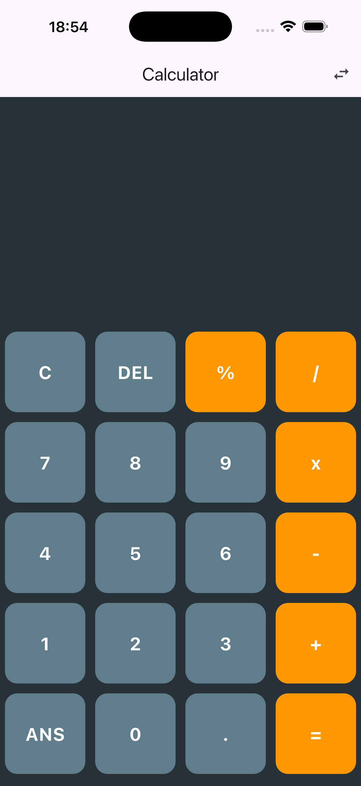
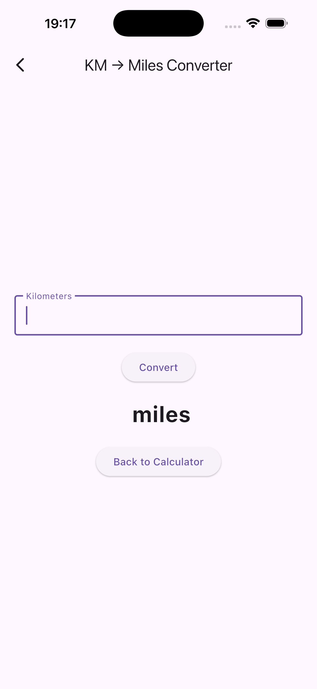

HEAD
This is my Home Assignment for Mobile Applications subject.
1. Added logic to the buttons.
2. Added kilometer to mile converter


# Flutter Calculator App

A simple calculator application built with **Flutter**.
The app supports basic arithmetic operations and includes an additional **kilometer to mile converter screen**.

---

## Features

* Basic calculator operations:

    * Addition
    * Subtraction
    * Multiplication
    * Division
    * Percent
* Delete and clear functions
* Expression evaluation
* **Kilometer → Mile converter**
* Navigation between calculator and converter screens
* Clean Flutter UI

---


## Screenshots

<p align="center">
  
  
</p>

---

## Kilometer to Mile Converter

The app also includes a separate screen that converts **kilometers to miles**.

Conversion formula used:

1 kilometer = **0.621371 miles**

Users can navigate to the converter from the calculator screen and return back easily.

---

## Technologies Used

* Flutter
* Dart
* math_expressions package

---

## Installation

Clone the repository:

```bash
git clone https://github.com/GomeZko/flutter-calculator.git
```

Go to the project folder:

```bash
cd flutter-calculator
```

Install dependencies:

```bash
flutter pub get
```

Run the application:

```bash
flutter run
```

---

## Author

Aleksandr

